# {.tabset}

## Homepage

### Hi, Elise!
Happy, happy birthday and congratulations on commencement! As a little treat for you, I have built this webpage to house some of our ideas for activities this summer. Each tab is dedicated to one activity or group of activities (excluding the "Other" tab). Click on one and you will find information about the activity! I really hope you enjoy this..I love you and can't wait to explore all of these things this Summer!

## June Trip to VT
### Trip to VT!
In the beginning of June, (exact times, dates, and locations are excluded for privacy reasons...) we will be travelling to the Burlington, VT area! All thanks to you and your amazing surprise for me. So, I wanted to put some of the food places and possible activities into here for you. This way, we can have them all in one place and refer to them easily. By the way, I've only included two restaurants here since we'll be there for a short time and many of the options are not very vegetarian friendly. Enjoy!

### **Food**
### The Stone Corral
Located at 83 Huntington Road in Richmond, VT, The Stone Corral Brewery is a local favorite. There's losts of things to get excited about at this brewery.

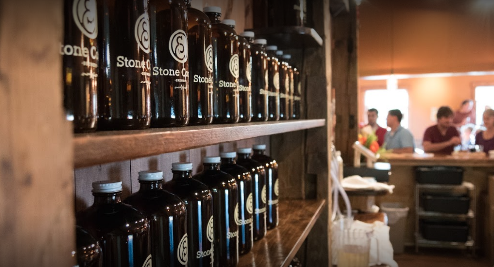

*Flights!*

Of course, we can't go to a brewery that doesn't offer flights! They have some amazing fruity flavors that I think you would, including a Strawberry Rhubarb Gose. 

*Other Drinks*

If you're not feeling a flight, they have some other drinks that you might enjoy. They've got margaritas, they've got a special moscow mule that features Maine Root Spicy Ginger Beer, a cocktail that features citizen cider, cherry sparkling cider, and lemon, and finally, they serve a shandy: a local cider made with lemonade! Lots of great options to drink here.

*Apps*

This place has it all!! Pretzel bites two ways: choose the salted pub pretzel bites for your classic pretzel with dipping cheese, or choose the Montreal pretzel bites for a pretzel with a twist (no pun intended): these babies have Montreal seasoning (whatever that means) and  are served with..are you ready... a garlic maple aioli. YUM!! In addition to these, they have chips with salsa & queso and sweet potato wedges. 

*The Main Course*

I must say that a lot of this menu is made up of meaty options, but there's still something there for us vegetarians. They've got burritos and burrito bowls which can be without meat, and a vegetarian taco where the main filling is sweet potato & pinto bean hash. They've got a whole nachos section on the menu! Multiple of these options are vegetarian. They've also got a mac & cheese section. The mac & cheese features brown butter bread crumbs and scallions. Drool!

Overall, this place is a classic pub/brewery with a local, somewhat hipster vibe. Lots of great options to eat & drink!

### Pascolo Ristorante
Located in downtown Burlington, this restaurant boasts that it is a "rustic-chic Italian nook serving wood-fired pizza along with upmarket pasta dishes & regional wines." I would call this one the slightly fancier Highbrow of Burlington.

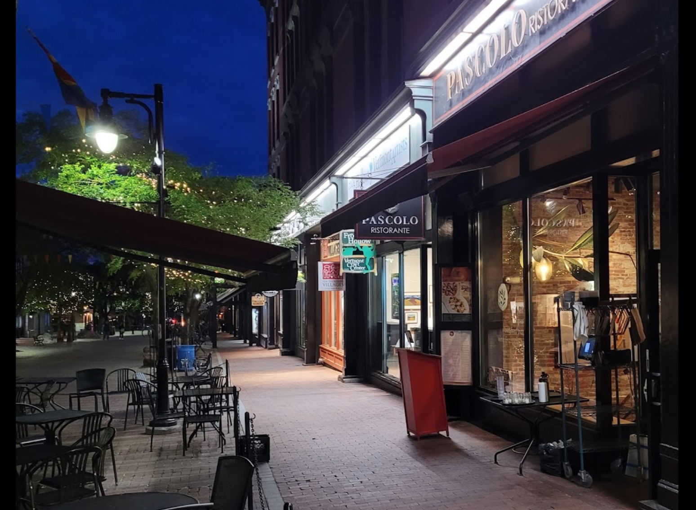

*Drinks*

Unfortunately, no flights here. It looks like they mostly pride themselves on their wine selection. I'm sure they have some beers and cocktails, but there's no full drink menu and not many drink pictures, so hard to tell exactly what they have.

*Apps (Or Primi, in this case..)*

At Pascolo, we can start with their caesar salad, the fried mozzarella with basil aioli, or the local burratini with bread, pesto, and olive oil. Classic Italian!

*The Main Course*

There are 2 important sections on the menu that you're going to want to look at: Pasta and Wood Fired Pizza. They've got lots to choose from! In the pasta section, the most exciting part is the gnocchi. They make their own gnocchi and serve it 3 different ways, all of which are vegetarian! The one that looks best is the sorrentina: gnocchi with tomato basil sauce, mozzarella, basil, and parmigiano. Yum!

In the pizza section, there's plenty of classics that you would expect. The two that I am most excited about are the margherita (pomodoro, extra virgin olive oil, mozzarella, basil) and the tomato pie (pomodoro, extra virgin olive oil, sliced garlic, parmigiano). It all sounds so good!!! Don't you think??

### **Ice Cream**
Of course, while in Vermont we have to get a creemee! Unfortunately, it looks like most of the creemee places are things like little stands that are only open seasonally. So, I have included a few different options for us.

### Lake Champlain Chocolate
This place is generally a chocolate shop, but in the center of Burlington they have a cute little cafe. They have lots of treats here and get good reviews. I think it might be a cute little place to stop in and grab a chocolate or an ice cream cone.

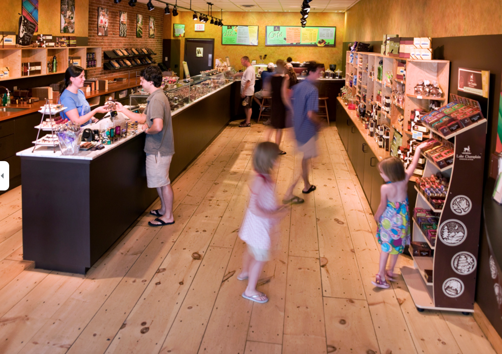

### Little Gordo Creemee Stand
This place is one of the creemee stands that I mentioned earlier. They are closed currently (only doing some weird takeout thing for hard ice cream) but I put it down because thought we could check back in a month. It's one of the higher rated ones so I think this would be a good choice if it is open.

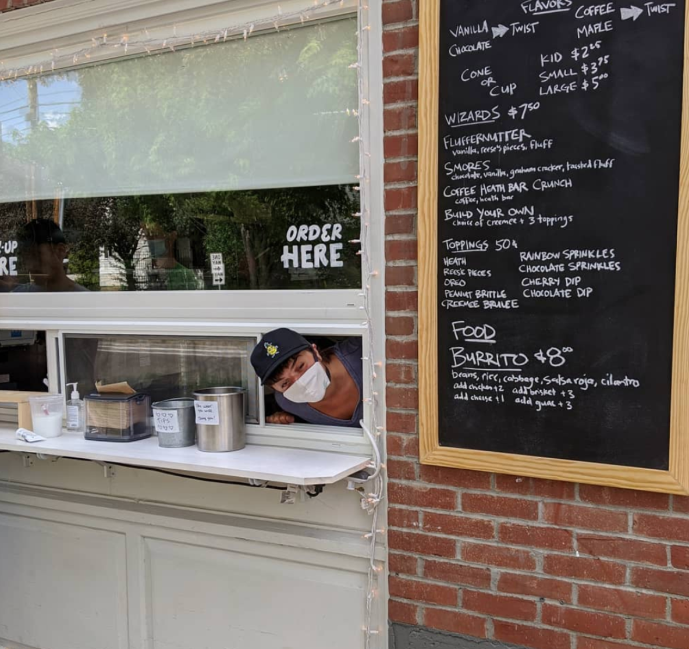
They're located right off of main street in Burlington and have a good selection of ice cream. They've got vanilla, chocolate, coffee and maple, and you can get a vanilla/chocolate twist or a coffee/maple twist!! I wish you liked coffee because that one sounds delicious. They have some specialties like the fluffernutter which consists of vanilla soft serve topped with reese's pieces and fluff, or the s'mores which consists of chocolate and vanilla ice cream with graham cracker and **toasted** fluff. MMMM! There's also plenty of other toppings if you don't want to go with one of their premade arrangements.

### Ben & Jerry's
Nuff Said! Classic Ben & Jerry's in its founding location. You know the sitch.

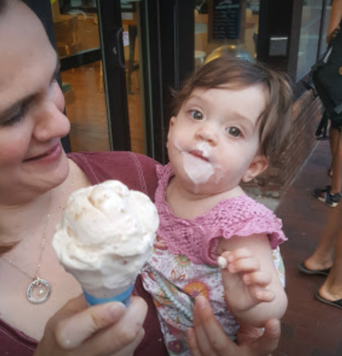
That could be us.

## Golf
### Golf!

This page is all about golf! I don't think I'm ready (or wanting to) play golf on an actual golf course, but I would love to go to the driving range and do some mini golfing with you. So, let's talk about some possible locations.

### Prodigy Minigolf & Gameroom
This place is in Easthampton and boasts a "challenging minigolf" course. It's kind of hidden in the ground floor of the Eastworks mill which I think is pretty cool. 

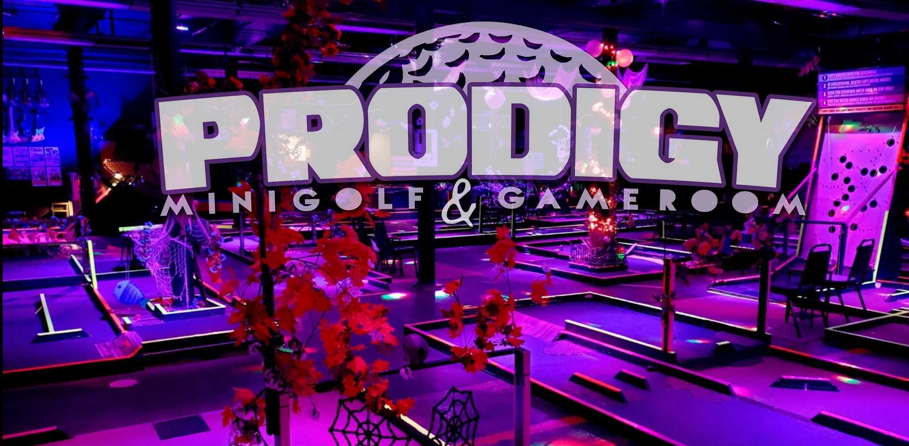

They have over 3500 video games and 150 board games. They also have pool and, of course, mini golf! Each person pays $15 and then you get access to all of the above. We can go just for mini golf, but we would also have access to anything else we want to play!

### Western Mass Family Golf Center

We know this place!! Right on Russell Street, we have already made our way over here a few times and I think it's safe to say that we would both be willing to go back. In addittion to the driving range that we have used, they also have a mini golf course. Their mini golf is what you probably envision when you think of mini golf. Very classic 18 hole course (with a bonus 19th hole ??) that costs $7.25 per person. Pretty good price!

They also have one of those crazy golf simulators. I think they're cool, but you have to schedule an appointment (and it would probably cost a lot) and I don't think either of us are serious enough about golf to really care to do that.

### Stony Falls Mini Golf

This place is located within McCray's Farm in South Hadley. This one also looks to be your standard mini golf course, and it only costs $7 per adult. We can also see some of the animals while they're there, and the creamery should be open for us to grab some ice cream! This seems like it would be a nice combo of activities for a hot day when we're looking for something to do :).

## Hiking
### Hiking

Hiking time!! I don't know much about hiking in Western Mass, but I took some of what you already had written down and did some more research with it. There is so so much hiking in the area. I've only included 3 different areas here that I thought would be the most notable places to visit, but I think we could have fun hiking anywhere!

### Mount Tom!
This is a classic, of course, but I've never been! During the Summer months you have to pay to park, but since I am an MA resident it's only $5. The Mount Tom Traverse via Metacomet-Monadnock trail seems to be a popular and moderately challenging one that we could try. It is a 5.3 mile out-and-back hike with about 1600 feet of elevation gain. Let's explore Mount Tom!!

### Mount Holyoke
Another classic! Parking is free here, so that's a plus, and they have more than 30 miles of trails. Apparently the seven sisters trail is pretty popular. 8 miles of a difficult hike through a series of summits and lookouts, with almost 1800 feet of elevation gain! There's another difficult but shorter trail called the Mt. Norwottuck & Horse Caves Hike. This one is 3.2 miles and 630 ft of elevation gain. Unfortunately these places are pretty bad about providing essential information about their hikes (LOL) so I had to do some extra research. There's a lot of mixed information about the length of the seven sisters trail, with some places saying 5 miles and others saying 14 miles, but the official website says 8 miles, so I will assume that other people are doing different variations of the hike. That being said, I only found one source which had the elevation gain on it, and their distance of the trail was off, so I am not sure if the elevation gain is accurate.

### The Appalachian Trail
This is a can't miss! We gotta go here at some point. Since the trail is SO long, it's hard to navigate some of the online resources for it. I think this would be one where we just go decide the day of what we want to do. There's so many options that I don't think we can really go wrong!

## Water Sports
### Water Sports

And by water sports, I mean paddle boats and kayaks LOL. Let's explore some of our options.

### The Valley Paddler
This is one that I have talked to you about before. They do kayaks, canoes, and pedal boats! The pedal boats are what I think would be the most fun, especially since we have never done something like that before, so that's my vote, but we can do whatever you want and of course we can go multiple times. For an hour, a pedal boat is \$30 and 2 hours would run us \$50. Not too cheap but pretty reasonable and I think that 1 hour would probbaly be plenty. The single kayaks are \$20 for an hour and the tandem kayaks and canoes are $25. They suggest making a reservation, but only take them 24 hours in advance, so this would be something that we would probably want to think about a bit in advance but we could also probably make a reservation not too far in advance.

### Pedal n Party
Okay baby, get ready for this. This place appears to be new (no reviews but a good website) place located in South Hadley. They've got 1 and 2 person kayaks, but we will not be using them. At Pedal n Party, we will be on **Hydrobikes**.

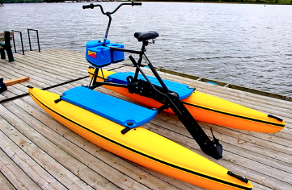

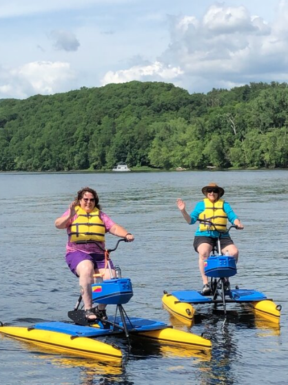

These crazy things are eco-friendly and go at speeds of 4-6 mph with minimal effort! It is \$30 for an hour on one of these bad boys, and only $5 for parking if we purchase it online. We MUST do this! They do online booking which is great so we can check availability as the Summer goes on and decide when we want to do it. This thing is truly awesome.

There are other places to do kayaking, but most of them are pretty far away, so I figured that we can stick to these 2 unless we really want to travel to CT or something, in which case we can investigate the options there.

## Berry Picking
### Berry Picking

Your favorite! These places are from your list, but I have again done some more research so that we can have a full overview of all of the places here.

### Pie in the Sky Berry Farm
This place is right in Northamption. They offer strawberry picking in June and blueberry picking in July! They havent't yet set an opening date but they said that they will say in May, so hopefully that will be up soon. Last years prices had a quart of strawberries at $5 and a quart of blueberries at \$8. Great prices and I'm sure they would be really delicious.

### Joe Czajkowski Farm
This farm is in Hadley and has lots of stuff! Starting on June 14, we can go pick strawberries. Pricing is unclear and there isn't much other info but looks like a fun place to go do some picking!

### BirdHaven Farm
BirdHaven is in Southhampton and their big draw is also blueberries! In addition to blueberries, though, they have black currants and Asian Pears (in the fall). I don't even know if I have ever had black currants, let alone picked them, so I would love to go pick some here! They are temporarily closed since it's not yet picking season so I also cannot tell the prices here, but I'm sure they're competitive. They have 1,068 blueberry bushes!!

### Sobieski's River Valley Farm
This farm is in Whately and, surprise, has blueberry picking! It seems like that's the common theme around here. Something new that i found out from this farm's Facebook, however, is that Maple Valley Ice Cream's stand (called Scoop at the Silos) does fresh blueberry sundaes with blueberries from this place...LOOK AT THIS:
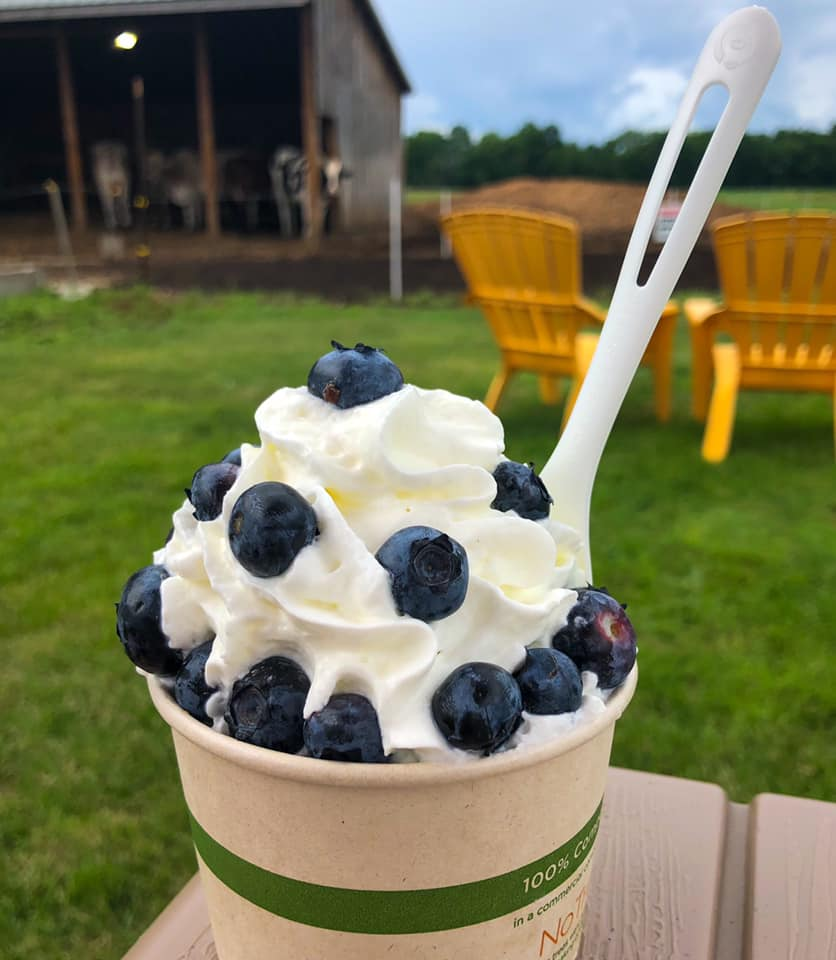
We MUST get one of these, Elise. It looks incredible.

## Swimming
### Swimming
Time to find some places to swim! I did my best to research this, but I also think that asking local people (like Marty) will help us find the best spots, so this is just a start!

### Puffer's Pond
Don't need to say much more! Nice little spot, free parking, but I think it can get pretty crowded in the Summer just because of how small the beach is. However, I did read that most of the traffic comes from the colleges so we can definitely see if it's less busy in the Summer once a lot of people go home.

### DAR State Forest
This place is in Goshen, which makes it about a 25 minute drive from us. Parking is $8 for MA residents (it's \$30 otherwise which is ridiculous!). There's a lake here that is open for people to fish and swim, and it's pretty close to the parking area so it looks like it would be easy to get to. Here's a couple pictures of the place:

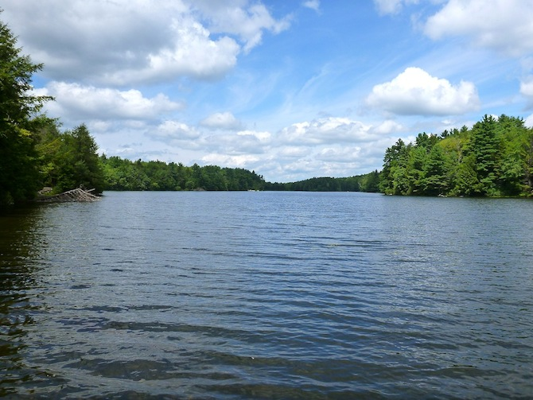
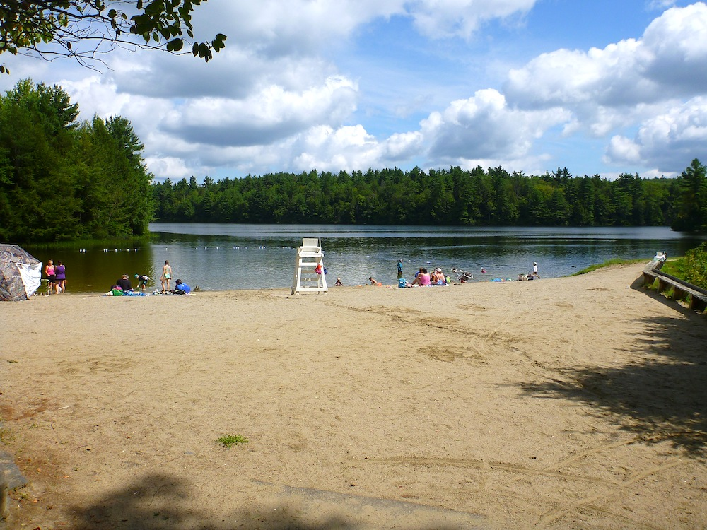
It looks like a beautiful place and there's plenty of picnic tables to sit and eat lunch and there's running water for me!!

### Musante Beach
This beach is in Leeds! The website is a bit confusing, but it looks like parking is free and then we have to pay $5 to walk on the beach? Not sure if this is worth it but it looked like a cute little place so figured I would make note of it.

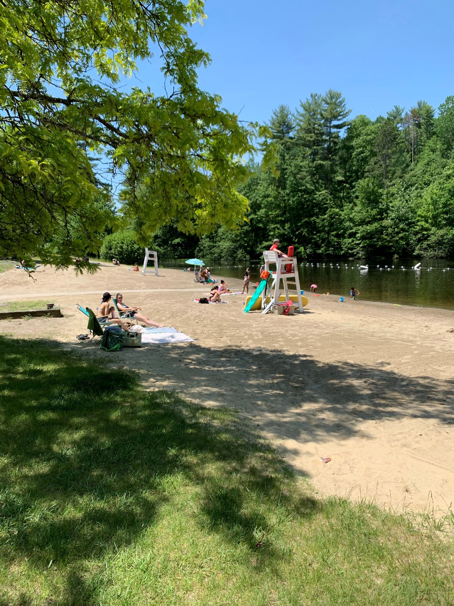

## Other

### Go Karting
#### Rail Explorers
Something I have always wanted to do is go on one of these freaky rail car things.

There aren't any in Western Mass that I have found, but this business has locations in Rhode Island and New York! I think the RI one especially would be doable. I think it would be a lot of fun and a great chance to see some cool landscape while having fun on one of the cars. It's $90 for two people which is definitely pricy but I think reasonable for the activity. They already have a couple days in May and June filled, so we should think about booking this early!

### The Book Mill
We've already been here so I don't need to tell you anything about it, but I wanted to put it here because I really want to go! I need another one of those brie/apple/apricot sandwiches. I also want to buy an awful book and make some awful blackout poetry with you! So let's do it. Note: I wrote this before we went with Marty and Rachel, but I still want to make another trip there with you!

